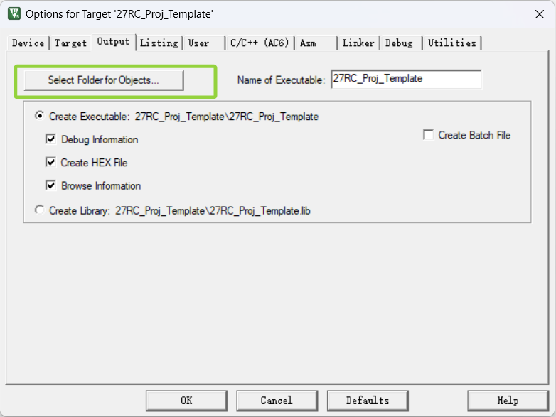
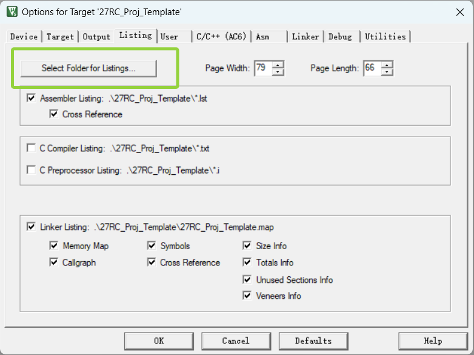

<!--
 * @Author: Frt001 2067314783@qq.com
 * @Date: 2026-08-25 20:54:07
 * @LastEditors: Frt001 2067314783@qq.com
 * @LastEditTime: 2026-08-25 20:56:09
 * @FilePath: \f4_show\DOCS\工程移植参考.md
 * @Description: 这是默认设置,请设置`customMade`, 打开koroFileHeader查看配置 进行设置: https://github.com/OBKoro1/koro1FileHeader/wiki/%E9%85%8D%E7%BD%AE
-->
# 工程重命名移植参考

> 本教程着重讲解,在拿到一个模版工程后,如何将工程名称、工程路径等进行修改,以便于在新项目中使用。

## 1.复制工程

将 `f4_show` 目录复制到新项目目录,并重命名为新项目名称,例如 `MyProject`,然后将项目名称复制到剪贴板。

## 2.修改工程文件

使用 `F2` (重命名) 将工程目录下的所有 `f4_show` 替换为新项目名称 `MyProject`,包括:
- `MDK-ARM/f4_show.uvprojx`
- `MDK-ARM/f4_show.uvoptx`
- `./f4_show.ioc`

## 3.删除不必要的文件

删除`MDK-ARM`目录下不需要的文件,例如:
- `f4_show.uvguix.xx`
- `MDK-ARM/f4_show` 整个文件夹
- `MDK-ARM/DebugConfig` 整个文件夹
- `.git`文件夹推荐删除,如果你不想琢磨git操作的话

在`MDK-ARM/`路径下创建新项目名称的文件夹 `MyProject`

## 4.配置keil工程输出路径

- 打开 `MDK-ARM/MyProject.uvprojx`,在 `Options for Target` -> `Output` 中修改输出路径为新项目名称,例如:
- `Executable` 改为 `MDK-ARM/MyProject`
  
- (可选)`Listing` 改为 `MDK-ARM/Listing` (自行创建 `Listing` 文件夹)
  